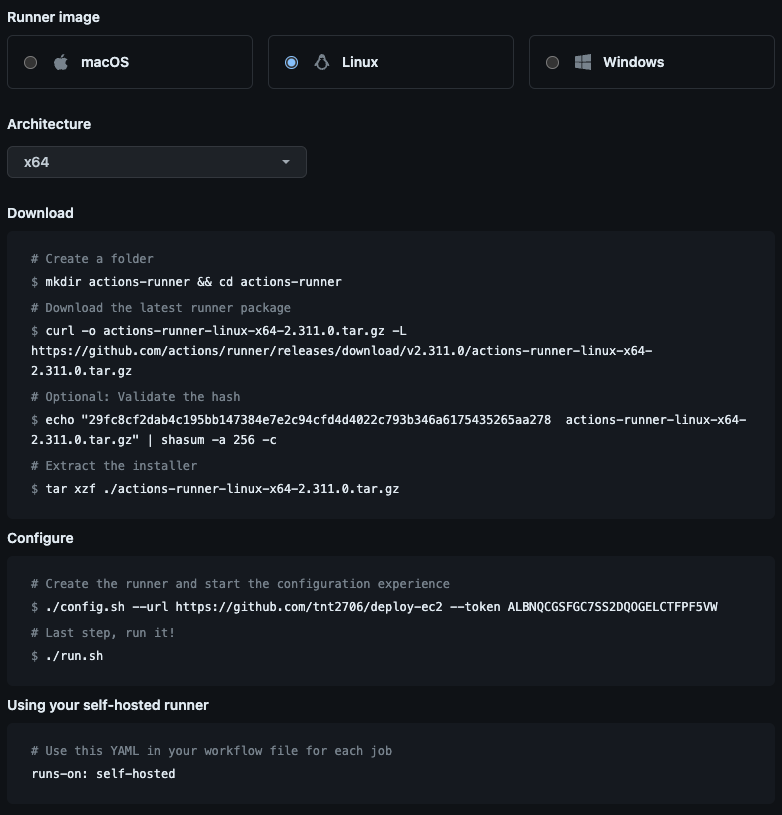
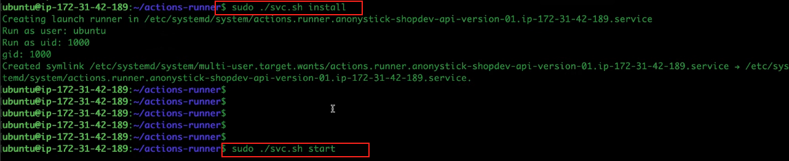

# Deploy EC2

## How to use

### clone git

```js
cd your-project
npm i
npm run dev
```

## Try

[localhost](http://localhost:3051)

## How to config Git action using `Runner`

### 1. Config runner

  

### 2. Install, start svc.sh and install node, pm2 in server ec2

 - **Run runner github with status `ide` in runner github**
  <br>

  

  - **Install**
    <br>

    > <b>Link install nodejs </b>
    > https://github.com/nodesource/distributions

    ```bash
    sudo apt-get install nodejs -y
    sudo npm install pm2@latest -g
    ```

    ```bash
    # Run server in folder below with folder `actions-runner`
    cd _work/{{folder_name_project}}/{{folder_name_project}}

    # With example
    cd _work/deploy-ec2/deploy-ec2
    ```

### 3. Create file yaml to on event to git local

  ```js
  // Create name to server in ec2
  pm2 start server.js --name=shopdev-backend

  // Add new line im folder .github/workflows/node.js.yaml
  pm2 restart shopdev-backend

  // Modify file .yaml
   runs-on: self-hosted

   // Open port 3000 in ec2

  ```
